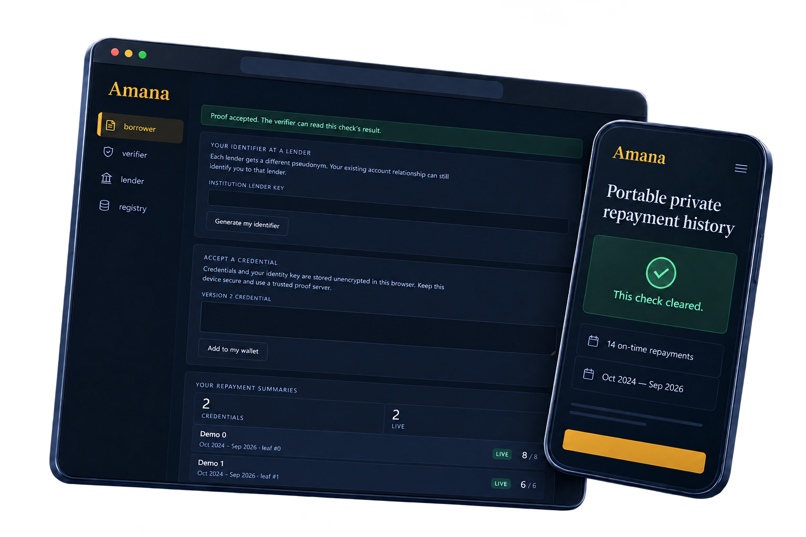
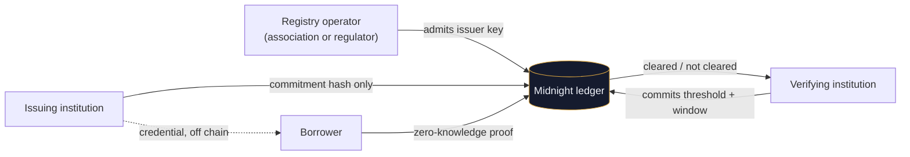
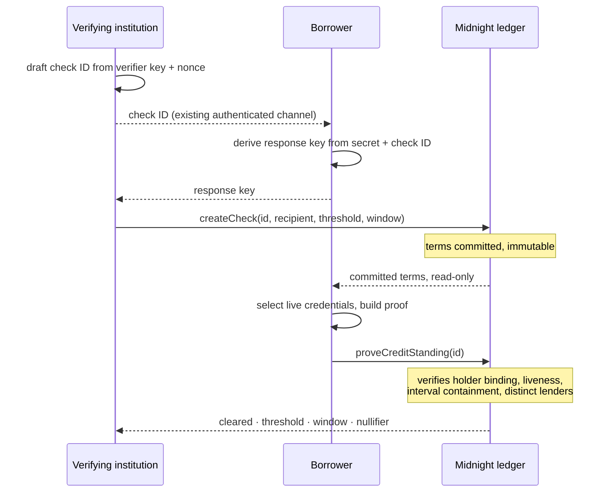

# Amana

<p align="center">
  
  &nbsp;&nbsp;
  <picture>
    <source media="(prefers-color-scheme: dark)" srcset="docs/assets/amana-wordmark-light.png">
    <source media="(prefers-color-scheme: light)" srcset="docs/assets/amana-wordmark-dark.png">
    
  </picture>
</p>

[](https://github.com/farouk-allani/amana/actions/workflows/verify.yml)


**Portable private repayment history on Midnight.** (Arabic أمانة, "a trust placed in someone's hands.")

<p align="center">
  
</p>

A borrower proves they cleared a repayment bar, such as *"at least 14 on-time repayments in the last 24 months"*, without revealing which institutions lent to them, how much they borrowed, their real repayment total, or how many records they used. The protocol creates no reusable public identifier for the borrower.

---

## The problem

Tunisia has six licensed microfinance companies operating nationally: Enda Tamweel, Taysir Microfinance, Baobab Tunisie, CFE Tunisie (DAAM), Advans Tunisie and Zitouna Tamkeen, alongside a network of microcredit associations under the regulator's supervision ([ACM register](https://www.financini.org.tn/organismList.php?a=t&v=1)). Enda alone runs [80 branches across all 24 governorates](https://www.bio-invest.be/en/investments/enda-tamweel-1), reported 502,523 active clients and 544,030 active loans at the end of 2024, and has served well over a million Tunisians across its lifetime. Taysir reported 38,654 active clients over the same period. Zitouna Tamkeen has financed [around 14,000 income-generating projects](https://www.isdb.org/economic-empowerment/success-stories/zitouna-tamkeen-1st-economic-empowerment-institution-in-north-africa) through 19 branches and two mobile units.

<p align="center">
  <picture>
    <source media="(prefers-color-scheme: dark)" srcset="docs/assets/market-landscape-dark.png">
    
  </picture>
</p>
<p align="center"><sub>Marks belong to their owners. Market reference only; no partnership or endorsement implied.</sub></p>

Six institutions, overlapping territories, and a borrower who repays one of them faithfully for three years walks into any of the other five and is underwritten as a stranger.

The obvious fix is a shared database of good borrowers. It has been proposed for decades and it does not exist, for a reason that has nothing to do with engineering: an institution's reliable repayers *are* its book. Publishing a list of who pays on time is publishing an acquisition target list for every competitor. No institution will do it, and no amount of database design changes that.

The regulator's system closes half the gap. Under [ACM Note 34](https://www.acm.gov.tn/Fr/telecharger.php?code=245), person, contract, closure and write-off flows to the Centrale des Risques de la Microfinance move in real time or by day-end. Balances and repayment schedules report monthly, due within ten days after the reporting cutoff. So the fact that a loan *exists* travels in a day, while the fact that it is *being repaid on time* can be up to forty days stale at the moment a second institution decides.

## The solution

Amana moves the evidence without moving the data. The issuing institution publishes an opaque 32-byte commitment and nothing else: no borrower, no amount, no count, no interval. The borrower holds the credential. When a second institution asks a question, the borrower answers that specific question with a zero-knowledge proof, and the verifier learns exactly one new fact: the bar was cleared.

The issuer discloses nothing, not even that it was involved. The verifier gains a current, cryptographically authenticated, issuer-backed fact. The borrower's own record becomes portable property instead of a competitor's asset.



Selective disclosure is not a privacy feature bolted onto this product. It is the only structure under which the counterparty ever agrees to participate.

## What the verifier sees

| | |
|---|---|
| Lender A issues | 8 on-time of 8 scheduled, Jan 2025 to Dec 2025 |
| Lender B issues | 6 on-time of 7 scheduled, Jan 2025 to Dec 2025 |
| Verifier asks | ≥ 14 on-time, inside Oct 2024 to Sep 2026 |
| Ledger records | **cleared · threshold 14 · window 2024-10 → 2026-09 · nullifier 0x4f2a…9c31** |

The verifier learns the bar was cleared. It does not learn that the answer was exactly 14, that two institutions contributed, or which two. A borrower with 40 on-time repayments answering the same check publishes a byte-identical public transcript, and [there is a test for that](#quality-evidence).

Amana proves a narrow positive statement. It is not a credit score, an affordability assessment, or a claim that the borrower has no other debt.

## The check protocol

The verifier sets the terms and commits them on chain *before* the borrower proves anything, so a borrower can never weaken a threshold and a stranger can never answer someone else's check.



An observer holding perfectly valid credentials of their own still cannot consume a check addressed to someone else, because the recipient binding fails. Authenticating the response-key exchange is the verifier's responsibility, and the protocol binds a wallet rather than a civil identity.

## Why Midnight

The product lives in the split between the two ledgers.

| Public ledger | Private witnesses |
|---|---|
| Registry authority, admitted lender keys | Borrower's secret key |
| Commitments, current Merkle root, leaf to issuer map | Per-lender borrower pseudonyms |
| Verifier keys, check IDs, thresholds, windows | Repayment counts and reporting intervals |
| Results, nullifiers, aggregate counters | Contributing lender identities, slot flags |

Three design decisions carry the whole thing:

**Per-lender pseudonyms.** A borrower's identifier at an institution is `H("amana:subject:", sk, lenderKey)`. Two institutions comparing their entire books cannot discover they share a customer, yet the circuit, which knows the secret, still aggregates across them. Unlinkable in public, aggregable in private.

**Revocation by leaf overwrite.** An issuer voids a credential by overwriting its leaf with the tree default, so every path through it stops verifying. The tree is deliberately a plain `MerkleTree` and **not** a `HistoricMerkleTree`, because the historic variant accepts past roots and would silently defeat revocation. No public revoked-set is consulted, so revocation leaks nothing about the borrower.

**Uniform proof shape.** Every proof performs exactly four live-root checks whether the borrower used one credential or four, so the number of institutions behind an answer never leaks. This is why `checkRoot` runs *before* the short-circuit: making a ledger read conditional on a witness would leak the borrower's credential count, and Compact's disclosure analysis correctly rejects it.

## Contract guarantees

Six circuits in [`contract/src/amana.compact`](contract/src/amana.compact).

| Circuit | Guarantee |
|---|---|
| `claimAuthority` | Only the key committed at deployment can activate the registry, once. Knowing the address does not let a stranger front-run it. |
| `registerLender` | Only that authority admits an issuer. |
| `issueAttestation` | Admitted issuer, key bound to the record, on-time ≤ scheduled, valid interval. Returns the allocated leaf index. |
| `revokeAttestation` | Only the original issuer can void a leaf it issued. |
| `createCheck` | Verifier-owned ID, non-zero recipient, positive threshold, valid immutable window. |
| `proveCreditStanding` | Existing unanswered check, bound holder, live membership, full-interval containment, distinct lenders, sufficient count. |

At most one summary per lender may contribute, so reissuing a cumulative snapshot under a fresh nonce cannot inflate a total. Counts are assertions by trusted issuers: zero-knowledge proves a credential is authentic and unrevoked, never that the underlying repayment occurred.

## Packages

| Package | What it is |
|---|---|
| `contract/` | Compact source, generated circuits, witness providers, an in-memory simulator, and 40 circuit tests |
| `api/` | `AmanaAPI`, a framework-agnostic service layer over the circuits, with 23 integration tests |
| `amana-ui/` | Four-role React application: Registry Operator, Issuing Institution, Borrower, Verifying Institution |
| `docs/` | [Privacy and trust boundaries](docs/PRIVACY.md), [go to market](docs/GO-TO-MARKET.md) |

## Quick start

Node 22.17+, Compact CLI 0.5.1, compiler 0.31.1, language 0.23. Install the CLI from the [pinned release](https://github.com/midnightntwrk/compact/releases/tag/compact-v0.5.1), then `compact update 0.31.1`.

```sh
npm ci
npm run compact      # compiles six circuits, generates proving/verifying keys
npm run typecheck
npm test             # 63 tests
npm run build
```

`npm run ci` runs all five in the order [GitHub Actions runs them](.github/workflows/verify.yml), on a clean Ubuntu runner with a checksum-pinned compiler.

Midnight does not support Windows natively. On Windows the compile script invokes WSL and the Linux user's `~/.local/bin/compact`; set `AMANA_WSL_DISTRO` if your distribution is not named `Ubuntu`. Node handles the remaining builds natively. For a fast syntax and disclosure-analysis pass without key generation, use `npm run compact:check --workspace=contract`.

## Deploy to preview

Amana reads the indexer and proof-server endpoints from the connected wallet's own configuration, so there are no network URLs to set. The network id is the only setting that has to match.

1. **Start a local proof server** and leave it running:

   ```sh
   docker run -p 6300:6300 midnightnetwork/proof-server \
     -- midnight-proof-server --network preview
   ```

2. **Point Lace at it.** Settings » Midnight » proof server » `Local (http://localhost:6300)`. Set the wallet to the preview network. A local prover is currently the only option Lace supports, which is also the right choice: the prover sees the witnesses.

3. **Fund the wallet.** In Lace, choose Receive and copy the **Unshielded** address, not the Dust or Cardano one, then request from the [preview faucet](https://midnight-tmnight-preview.nethermind.dev/). Register the tNIGHT for dust generation; DUST accrues over the following hours and is what pays fees.

4. **Configure and run:**

   ```sh
   cp amana-ui/.env.example amana-ui/.env.local   # VITE_NETWORK_ID=preview
   npm run ui
   ```

5. **Deploy.** Leave the address field blank and choose *Deploy a new registry*, then approve in Lace. The address appears in the masthead and is remembered; every other actor joins by pasting it.

Valid network ids are `preview`, `preprod`, `mainnet` and `undeployed`. The retired `testnet-02` endpoints no longer resolve, and a wrong id surfaces as an indexer connection failure rather than a clear error.

## How to evaluate this submission

The fastest honest path from a clean clone to seeing the privacy property hold:

1. **Confirm the technical gate**, about two minutes. `npm ci && npm run compact` compiles six circuits and writes proving keys under `contract/src/managed/`.
2. **Run the adversarial suite**, about fifteen seconds. `npm test`. The interesting cases are not the happy path: `rejects squatting a known verifier ID even with its nonce`, `prevents a credentialed observer intercepting a public check`, `does not let a recent final payment make lifetime counts recent`, and `has an identical public transcript for one or four records`.
3. **Drive the four roles.** Use separate browser profiles for operator, lender A, lender B, borrower and verifier. Role tabs inside one profile share an identity, so switching tabs does not create a second lender. Deploy a registry, activate it, admit both lender keys, issue 8/8 and 6/7 with matching intervals, run the five-step protocol at threshold 14, and read the result.
4. **Break it.** Revoke lender A's leaf as lender A. The borrower's wallet marks the credential not live and a fresh check at 14 can no longer be answered. The circuit-level regression that bypasses the UI is `rejects a revoked witness but retains a historical accepted check`.

A monthly period is `(UTC year − 1970) × 12 + UTC month index`. September 2026 is period 680, and a 24-month window ending there is 657 to 680.

## Quality evidence

**63 passing tests**, all against compiled circuits rather than mocks.

- **40 circuit tests** covering authority front-running, issuer impersonation, inflated counts, reversed intervals, ID squatting, term rewriting, check interception by a credentialed outsider, lifetime-count laundering, double-counted leaves, overlapping same-lender snapshots, revocation, and wrong-index liveness.
- **23 API integration tests** covering the full lifecycle, wallet liveness on public revocation events, duplicate and malformed credential rejection, private-state cleanup after transaction failure, and operation serialization so concurrent issuance cannot overwrite pending witnesses.
- **A privacy property written as a regression test.** `has an identical public transcript for one or four records satisfying the same check` executes the compiled circuit twice against the same ledger and check, once with one contributing credential and once with four, then asserts the complete public transcripts and public inputs are equal while the private transcripts differ.

Circuit tests execute generated Compact circuits against the local runtime. API tests simulate providers and finalization; they do not submit transactions or generate cryptographic proofs.

## Known limits

Stated plainly, because a privacy product that hides its own weaknesses is not offering privacy.

- **Issuer trust is the root.** Zero-knowledge proves a credential is authentic, bound to the holder and live. It cannot prove a real repayment happened. Registry admission and issuer audit remain required controls.
- **Capacity.** Tree depth 10 gives 1,024 lifetime issuance positions and revocation does not free them. Four lenders per proof, 16-bit thresholds.
- **Storage.** Identity keys and credentials sit unencrypted in browser localStorage. Encrypted storage, export and recovery are Wave 2 work.
- **Metadata.** Indexers see requests and IP addresses. Cryptographic unlinkability does not survive timing correlation, a small anonymity set, or an institution that already knows its customer through KYC.
- **No trusted clock.** The verifier chooses the upper window bound; the chain asserts no date.
- **Governance.** One authority key, no rotation, no lender removal circuit, no check expiry or per-verifier quota.

Full analysis in [docs/PRIVACY.md](docs/PRIVACY.md).

## Roadmap

**Wave 2.** Encrypted private storage with export and recovery, including a split-key or social-recovery path so a lost phone does not turn a borrower back into a stranger. Larger tree or sharding with benchmarks. Issuance batching. Proving a *minimum count of distinct lenders* privately, since pairwise distinctness exists today but a minimum-count claim does not. Issuer governance and lender removal.

**Wave 2, measured.** Two things the current design pays for and has not yet quantified. First, every issuance or revocation advances the Merkle root, so a proof built against the previous root fails on submission; the failure rate under concurrent issuance needs measuring, and a bounded recent-root window is the candidate fix that keeps revocation meaningful without the full-history acceptance that defeats it. Second, every derived value here (commitments, pseudonyms, nullifiers, response keys) lands in ledger state, so `persistentHash` is the correct primitive, but it is the non-circuit-optimised one and a single proof evaluates it around ten times; proving time on consumer hardware needs a number.

**Wave 3.** Policy-banded disclosure, scoped verifier view keys, and an integration evaluation against synthetic institutional exports. An exploration of a loan-stacking signal: nullifiers are unlinkable by design, so counting a borrower's open checks needs an epoch-scoped construction that trades a bounded amount of unlinkability for it, and whether that trade is acceptable is a question for risk staff, not for the circuit.

## Ecosystem attribution

Built on [Midnight](https://midnight.network) for the Midnight Buildathon on AKINDO, using the Compact language and compiler, `@midnight-ntwrk/compact-runtime`, the midnight-js provider suite, the Lace wallet DApp connector, and the Midnight proof server. Structure follows the patterns in Midnight's [example DApps](https://github.com/midnightntwrk).

Topics: `midnightntwrk` `midnight` `compact` `zero-knowledge` `privacy` `fintech` `microfinance`

## License

Apache-2.0, see [LICENSE](LICENSE). All Midnight-related code in this repository is Apache-2.0 licensed.
